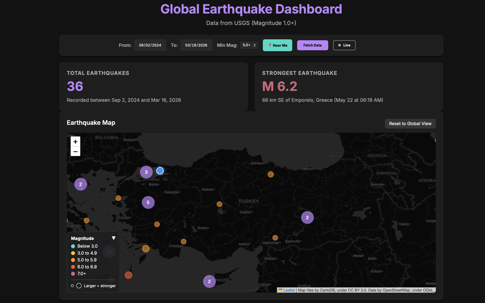

# Global Earthquake Dashboard

An interactive, responsive, and real-time dashboard for visualizing global earthquake data. By fetching live data from the USGS API, it provides intelligent data mapping, clustered visualizations, and viewport-synced charts to help observe and analyze global seismic activity easily.

## Features

- **Live Mode (Auto-Refresh):** Watch real-time seismic events unfold. Toggling "Live" locks the map to a 24-hour window and queries data every 60 seconds automatically.
- **Interactive Map:** Powered by Leaflet and CartoDB dark tiles. It plots earthquakes using dynamic marker colors by magnitude.
- **Clustered Rendering:** Huge datasets are handled gracefully via `Leaflet.markercluster`, automatically grouping closely bundled earthquakes and displaying counts.
- **Viewport-Synced Visuals:** Panning or zooming the map instantly re-aggregates data on the fly. The Chart.js distributions and metrics update using only the earthquakes visible on your screen.
- **Browser Geolocation:** A one-click "Near Me" button geolocates your browser and pins you on the map, allowing for rapid localized earthquake checking.
- **Smart Query Validation:** Heavy queries spanning a long range (>30 days) automatically adjust the minimum magnitude to prevent API overloading.
- **Dynamic Charting:** "Magnitude Distribution" intelligently readjusts its X-axis buckets dynamically depending on the selected minimum magnitude constraint.
- **Dark Theme:** High-contrast responsive design optimized for desktop and mobile reading.

## Tech Stack

This project is built powerfully using minimal dependencies and no heavy build tools:
- **Vanilla JavaScript** (ES6+)
- **Vanilla CSS3**
- [**Chart.js**](https://www.chartjs.org/)
- [**Leaflet.js**](https://leafletjs.com/) & [**Leaflet.markercluster**](https://github.com/Leaflet/Leaflet.markercluster)
- **CartoDB** Dark Tiles
- **USGS Earthquake API**

## How to Use

Simply open the `index.html` file in any modern web browser or use a local dev server like `npx serve`. No build process is required!

> **Live Demo:** [https://earthquake-dashboard-blush.vercel.app](https://earthquake-dashboard-blush.vercel.app)

## Data Source

All earthquake data is directly sourced and fetched live from the [USGS (United States Geological Survey) Earthquake Catalog API](https://earthquake.usgs.gov/fdsnws/event/1/).

## Roadmap

- [ ] URL-state sharing (encode current query params into the URL for easy sharing).
- [ ] Depth cross-section visualization.
- [ ] Push notifications via browser APIs for nearby earthquakes above a user-specified threshold.

## Author

**Akin Moroglu** - [akinmoroglu.com](https://akinmoroglu.com)
